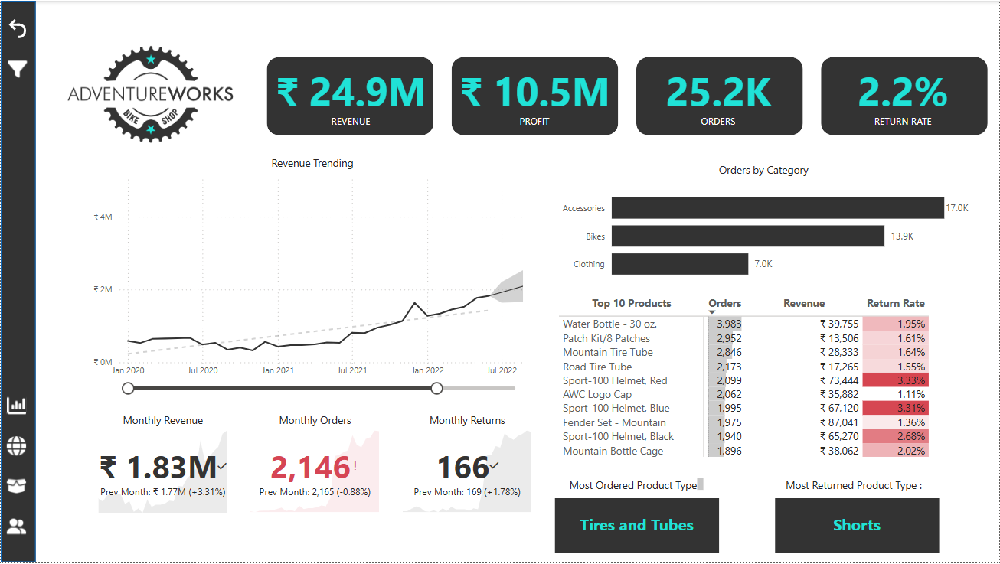
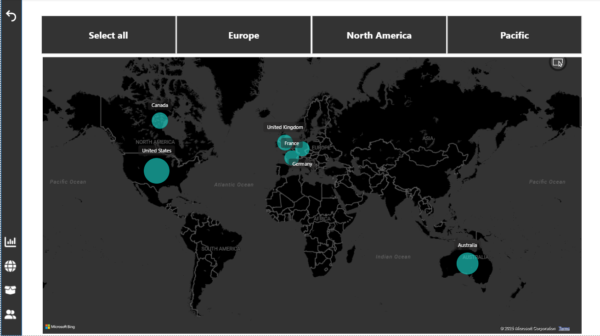
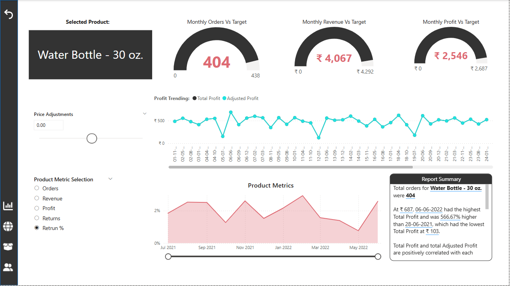
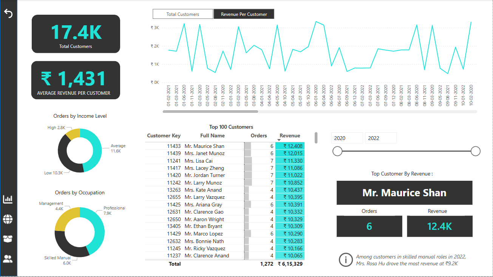

# Adventure Works Sales Dashboard

This is a Power BI dashboard project built using simulated business data from Adventure Works, a global bike manufacturing company.

### 📊 What it Includes:
- Sales vs Cost analysis
- Product performance
- Territory-wise insights (Map View)
- Customer purchase behavior & loyalty metrics

### 🔧 Built as Part of:
A guided Power BI course to demonstrate hands-on BI reporting skills using real-world-like datasets.

---

📁 **Included**: `.pbix` file + screenshot  
🔗 [Check out the full dashboard here](Add Notion link here once it's ready)

## 🔥 Dashboard Preview

### 📌 Main Dashboard

### 🌍 Map View

### 📦 Product Breakdown

### 👤 Customer Details

## 🛠️ Skills Demonstrated
- Power BI (Data Modeling, DAX, Visualizations)
- Data Transformation with Power Query
- Business Intelligence & Reporting
- Sales, Customer, and Product Analysis

## 💡 What I Learned
- How to create interactive dashboards using Power BI
- Real-world application of business metrics (Sales, Cost, Profit, Returns)
- Using maps and filters to improve data insights
- Structuring multi-page dashboards for better storytelling

